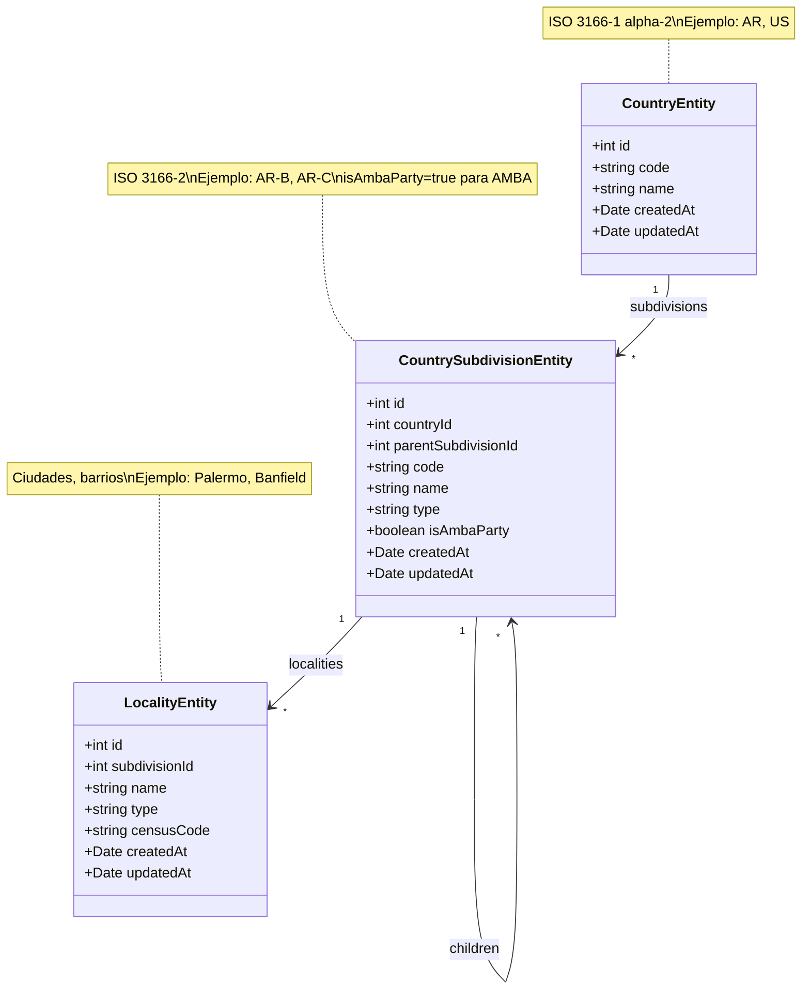

# ISO 3166-2 Argentina Location Database

Mini proyecto de ejemplo para crear tablas de base de datos siguiendo el estándar ISO 3166-2 con datos oficiales de Argentina.

## 📋 Descripción

Este proyecto implementa un sistema de ubicaciones normalizado basado en el estándar ISO 3166-2, específicamente diseñado para Argentina. Incluye:

- **Countries**: Países con códigos ISO 3166-1 alpha-2 (`AR`, `US`, etc.)
- **Country Subdivisions**: Divisiones administrativas jerárquicas
  - Provincias (nivel 1)
  - Departamentos/Partidos (nivel 2)
- **Localities**: Ciudades, pueblos, barrios y parajes

### Características especiales

- ✅ Códigos ISO 3166-2 oficiales para todas las provincias argentinas
- ✅ Soporte para estructura jerárquica (Provincia → Partido → Localidad)
- ✅ Flag `isAmbaParty` para identificar los 40 partidos del AMBA + CABA
- ✅ Datos descargados desde [datos.gob.ar](https://datos.gob.ar/) (INDEC)

## 🗃️ Diagrama de Clases 



[📊 Ver diagrama en Mermaid Live Editor](https://mermaid.live/edit#pako:eNqNkk1uwzAMhK9CaN0c4Au4QJIG7aJFu9DSJGZsKpGoH7cIcve6ttM0XRRezfDjkBzxLGpvUBRiDz5Sh7pChiNc7K5E-oBqb8nBEshhg0mP4AM4CpI2mMJpPgZC3kNrIRF0wfAefAePaLpnOAa_bXb4OaEb4JzRJ7xBS-8mHZ4CHZfwhh0dQ0Y6QHaTJ-N8kKMu4Qkawkx6v4cDpHD5B_8WDnBAk4APEE6JvoFxAOcIL57CcFKTJx3LvzCZAV4ShdNfuN0BHQy-hMQxBa_-QYYLhHTxC_6MWENqEd7hLy4_gBbIb1JIscRUW83RYE3bEI2hIJqglpJLEbOLJcpKRGp0I2I9sFHM6k)

## 🚀 Instalación

```bash
# Instalar dependencias con pnpm
pnpm install

# Ejecutar migraciones y seed de datos de Argentina
pnpm seed

# Ver ejemplos de consultas
pnpm dev
```

## 📦 Scripts disponibles

| Comando | Descripción |
|---------|-------------|
| `pnpm seed` | Descarga datos de Argentina y hace el seed de los datos en la BD |
| `pnpm dev` | Ejecuta ejemplos de consultas |
| `pnpm test` | Ejecuta tests de integración (23 tests) |
| `pnpm test:watch` | Ejecuta tests en modo watch |
| `pnpm build` | Compila TypeScript |
| `pnpm start` | Ejecuta versión compilada |

## 📊 Datos de Argentina

### Fuentes oficiales (datos.gob.ar)

| Archivo | URL |
|---------|-----|
| Provincias | https://infra.datos.gob.ar/.../provincias.csv |
| Departamentos | https://infra.datos.gob.ar/.../departamentos.csv |
| Localidades | https://infra.datos.gob.ar/.../localidades.csv |

### Códigos ISO 3166-2 de Argentina

| Código | Provincia |
|--------|-----------|
| AR-C | Ciudad Autónoma de Buenos Aires |
| AR-B | Buenos Aires |
| AR-K | Catamarca |
| AR-X | Córdoba |
| AR-W | Corrientes |
| AR-H | Chaco |
| AR-U | Chubut |
| AR-E | Entre Ríos |
| AR-P | Formosa |
| AR-Y | Jujuy |
| AR-L | La Pampa |
| AR-F | La Rioja |
| AR-M | Mendoza |
| AR-N | Misiones |
| AR-Q | Neuquén |
| AR-R | Río Negro |
| AR-A | Salta |
| AR-J | San Juan |
| AR-D | San Luis |
| AR-Z | Santa Cruz |
| AR-S | Santa Fe |
| AR-G | Santiago del Estero |
| AR-V | Tucumán |
| AR-T | Tierra del Fuego |

### AMBA (Área Metropolitana de Buenos Aires)

El campo `isAmbaParty` está marcado como `true` para:
- CABA (Ciudad Autónoma de Buenos Aires)
- 40 partidos del conurbano bonaerense

## 💡 Ejemplos de uso

### Obtener todas las provincias

```typescript
const provinces = await subdivisionRepo.find({
  where: { parentSubdivisionId: IsNull() },
  order: { name: "ASC" },
});
```

### Obtener partidos del AMBA

```typescript
const ambaPartidos = await subdivisionRepo.find({
  where: { isAmbaParty: true },
  order: { name: "ASC" },
});
```

### Obtener partidos de Buenos Aires

```typescript
const bsAs = await subdivisionRepo.findOne({ where: { code: "AR-B" } });
const partidos = await subdivisionRepo.find({
  where: { parentSubdivisionId: bsAs.id },
});
```

### Obtener localidades de un partido

```typescript
const lomasDeZamora = await subdivisionRepo.findOne({ 
  where: { name: "Lomas de Zamora" } 
});
const localities = await localityRepo.find({
  where: { subdivisionId: lomasDeZamora.id },
});
```

## 🔍 Flujo Frontend (ejemplo)

```
1. País:      GET /locations/countries 
              → Select "Argentina" (id: 1)

2. Provincia: GET /locations/subdivisions?countryId=1 
              → Select "Buenos Aires" (id: 2, code: AR-B)

3. Partido:   GET /locations/subdivisions?parentId=2 
              → Select "Lomas de Zamora" (id: 102)

4. Localidad: GET /locations/localities?subdivisionId=102 
              → Select "Banfield" (id: 1020)

5. Submit:    { countryId: 1, subdivisionId: 102, localityId: 1020 }
```

## 🧪 Testing

El proyecto incluye **23 tests de integración** que verifican la base de datos real (sin mocks):

```bash
pnpm test
```

### Suites de tests

| Suite | Tests | Descripción |
|-------|-------|-------------|
| Countries | 2 | Verifica que Argentina existe con código AR |
| Provinces | 4 | Valida las 24 provincias con códigos ISO 3166-2 |
| AMBA | 4 | Verifica partidos del AMBA (isAmbaParty) |
| Partidos | 2 | Valida 135 partidos de Buenos Aires |
| Localities | 3 | Verifica localidades (4000+) |
| Hierarchical Queries | 2 | Navega País → Provincia → Partido → Localidad |
| Search Queries | 3 | Búsquedas por tipo, AMBA, patrones |
| Data Integrity | 3 | Valida foreign keys e integridad |

### Ejemplo de output

```
✓ Countries (2)
✓ Provinces (ISO 3166-2 subdivisions) (4)
✓ AMBA (Área Metropolitana de Buenos Aires) (4)
✓ Partidos of Buenos Aires Province (2)
✓ Localities (3)
✓ Hierarchical Queries (2)
✓ Search Queries (3)
✓ Data Integrity (3)

Test Files  1 passed (1)
Tests       23 passed (23)
```

## 📁 Estructura del proyecto

```
src/
├── config/
│   └── data-source.ts      # Configuración TypeORM
├── entities/
│   ├── country.entity.ts
│   ├── country-subdivision.entity.ts
│   └── locality.entity.ts
├── migrations/
│   └── 1705000000000-CreateLocationTables.ts
├── scripts/
│   └── seed-locations.ts   # Descarga y hace el seed de los datos
├── tests/
│   └── location.integration.test.ts  # 23 tests de integración
└── index.ts                # Ejemplos de consultas
```

## 📄 Licencia

MIT
